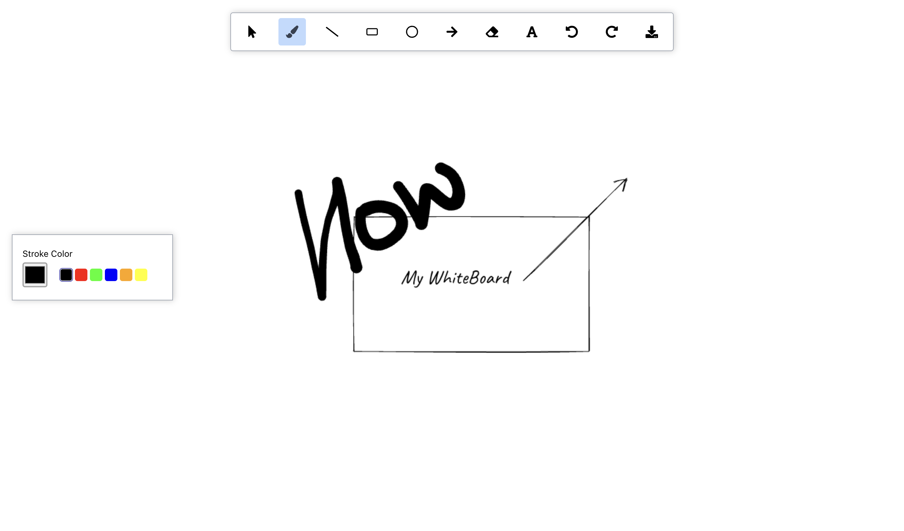

# 🎨 Digital Whiteboard App

[](https://github.com/wasimrehman05/whiteboard-tutorial)
[](https://reactjs.org/)
[](LICENSE)
[](https://nodejs.org/)


> A React-based whiteboard application I built to learn more about canvas manipulation and complex state management. Started as a simple drawing app but ended up with a lot more features than I initially planned.

## 📸 Demo



## ✨ What it does

> This is a fully functional digital whiteboard with most of the features you'd expect:

**Drawing tools:**
- Brush for freehand drawing
- Basic shapes (rectangles, circles, lines, arrows)
- Text tool
- Eraser
- Selection tool for moving stuff around

**Features:**
- Copy/paste functionality (Ctrl+C/V)
- Undo/redo that actually works
- Drag and drop to move selected elements
- Download your drawing as an image
- Custom cursors for each tool
- Pretty smooth performance even with lots of elements

## 🚀 How to run it

```bash
git clone 
npm install
npm start
```

Then go to http://localhost:3000

## ⚙️ How it works

> The app uses HTML5 Canvas for drawing, with React handling the UI and state management. I used a few libraries to make life easier:

- **RoughJS** - gives shapes that hand-drawn look
- **perfect-freehand** - makes brush strokes look natural
- **Tailwind CSS** - for styling without writing much CSS

## ⌨️ Keyboard shortcuts

- `Ctrl/Cmd + Z` - Undo
- `Ctrl/Cmd + Y` - Redo  
- `Ctrl/Cmd + C` - Copy selected elements
- `Ctrl/Cmd + V` - Paste
- `Delete` - Remove selected elements

## 🛠️ Technical details

> The architecture is pretty straightforward:
- React Context for state management
- Canvas API for actual drawing
- Custom hooks for mouse/keyboard events
- Reducer pattern for complex state updates

**Project structure:**
```
whiteboard-tutorial/
├── public/
│   ├── index.html          # Main HTML template
│   └── favicon.ico         # App icon
├── src/
│   ├── components/
│   │   ├── Board/
│   │   │   ├── index.js            # Main canvas component
│   │   │   └── index.module.css    # Canvas styling + cursors
│   │   ├── Toolbar/
│   │   │   ├── index.js            # Tool selection buttons
│   │   │   └── index.module.css    # Toolbar styling
│   │   └── Toolbox/
│   │       ├── index.js            # Tool customization panel
│   │       └── index.module.css    # Toolbox styling
│   ├── store/
│   │   ├── BoardProvider.js        # Main drawing logic & state
│   │   ├── board-context.js        # Drawing context definition
│   │   ├── ToolboxProvider.js      # Tool settings state
│   │   └── toolbox-context.js      # Toolbox context definition
│   ├── utils/
│   │   ├── element.js              # Drawing elements creation & selection
│   │   └── math.js                 # Geometry calculations
│   ├── constants.js                # Tool types, actions, colors
│   ├── index.js                    # App entry point
│   ├── index.css                   # Global styles
│   └── App.js                      # Main app component
├── screenshots/                    # Demo images for README
├── package.json                    # Dependencies & scripts
├── tailwind.config.js              # Tailwind CSS configuration
└── README.md                       # This file
```

**Key files explained:**
- `BoardProvider.js` - Contains all the drawing logic, history management, and state
- `element.js` - Functions for creating, moving, and detecting elements
- `Board/index.js` - Renders the canvas and handles mouse/keyboard events
- `constants.js` - Defines all tool types, colors, and action constants

## 🚧 What I might add later

- Different layers for organizing drawings
- More shape options
- Better phone/tablet support
- Save and load your drawings
- Let multiple people draw together

## Built with ❤️ using

- React 18
- HTML5 Canvas
- RoughJS
- perfect-freehand
- Tailwind CSS
- Create React App

## 📄 License

This project is licensed under the MIT License - see the [LICENSE](LICENSE) file for details.

## 👨‍💻 Author

**Wasim Rehman**
- GitHub: [@wasimrehman05](https://github.com/wasimrehman05)

---

⭐ **Star this repository if you found it helpful!** 