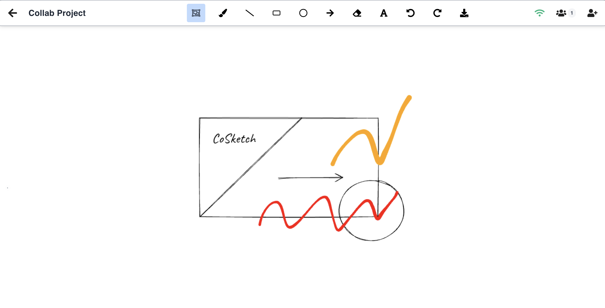

# CoSketch - Collaborative Digital Whiteboard

[](https://github.com/wasimrehman05/cosketch-frontend)
[](https://reactjs.org/)
[](LICENSE)
[](https://nodejs.org/)

> CoSketch is a real-time collaborative digital whiteboard where multiple users can draw, sketch, and create together. Built with React, WebSockets, and HTML5 Canvas. Perfect for remote teams, online classrooms, or brainstorming sessions.

## 📸 Demo



## ✨ Features

**Real-time Collaboration:**
- Multiple users can draw simultaneously
- Live user count and connection status
- Real-time synchronization of all drawing actions
- WebSocket-based communication for instant updates

**Drawing Tools:**
- **Brush Tool** - Freehand drawing with natural stroke rendering
- **Shapes** - Rectangles, circles, lines, and arrows
- **Text Tool** - Add and edit text annotations
- **Eraser** - Remove elements with precision
- **Selection Tool** - Move, copy, and manipulate elements

**Core Features:**
- **Copy/Paste** - Ctrl+C/V for quick element duplication
- **Undo/Redo** - Full history management with Ctrl+Z/Y
- **Drag & Drop** - Intuitive element manipulation
- **Export** - Download drawings as PNG images
- **Auto-save** - Automatic canvas persistence
- **User Management** - Register, login, and profile management

## 🚀 Getting Started

### Prerequisites
- Node.js 14+ 
- MongoDB (for the backend)
- Backend server running (see backend README)

### Installation

```bash
# Clone the repository
git clone https://github.com/wasimrehman05/cosketch-frontend.git
cd cosketch-frontend

# Install dependencies
npm install

# Start the development server
npm start
```

The app will open at http://localhost:3000

### Environment Setup
Create a `.env` file in the frontend directory:
```env
REACT_APP_API_BASE_URL=http://localhost:3001/api/v1
REACT_APP_WEBSOCKET_SERVER_URL=http://localhost:3001
REACT_APP_ENV=development
```

## ⚙️ Architecture

CoSketch uses a modern React architecture with real-time collaboration:

**Frontend Technologies:**
- **React 18** - UI framework with hooks and context
- **HTML5 Canvas** - Core drawing surface
- **WebSockets** - Real-time communication via Socket.IO
- **RoughJS** - Hand-drawn style rendering for shapes
- **perfect-freehand** - Natural brush stroke rendering
- **Tailwind CSS** - Utility-first styling

**State Management:**
- React Context for global state
- useReducer for complex state logic
- Custom hooks for WebSocket communication

## ⌨️ Keyboard shortcuts

- `Ctrl/Cmd + Z` - Undo
- `Ctrl/Cmd + Y` - Redo  
- `Ctrl/Cmd + C` - Copy selected elements
- `Ctrl/Cmd + V` - Paste
- `Delete` - Remove selected elements

## 🛠️ Project Structure

```
whiteboard-frontend/
├── public/
│   ├── index.html              # Main HTML template
│   └── favicon.ico             # App icon
├── src/
│   ├── components/
│   │   ├── Board/              # Canvas drawing component
│   │   ├── Toolbar/            # Main toolbar with tools
│   │   ├── Toolbox/            # Tool customization panel
│   │   ├── Notification/       # User notifications
│   │   └── ProtectedRoute.js   # Route protection
│   ├── pages/
│   │   ├── Canvas.js           # Main canvas page
│   │   ├── Home.js             # Dashboard/home page
│   │   ├── Login.js            # Authentication
│   │   └── Register.js         # User registration
│   ├── services/
│   │   ├── CanvasService.js    # Canvas API calls
│   │   ├── userService.js      # User API calls
│   │   └── websocketService.js # WebSocket communication
│   ├── store/
│   │   ├── BoardProvider.js    # Main drawing logic & state
│   │   ├── board-context.js    # Drawing context
│   │   ├── ToolboxProvider.js  # Tool settings state
│   │   └── toolbox-context.js  # Toolbox context
│   ├── context/
│   │   └── AppContext.js       # Global app context
│   ├── hooks/
│   │   └── useAuth.js          # Authentication hook
│   ├── utils/
│   │   ├── element.js          # Element creation & selection
│   │   └── math.js             # Geometry calculations
│   ├── constants/
│   │   └── websocket.js        # WebSocket constants
│   ├── constants.js            # App constants
│   ├── index.js                # App entry point
│   ├── index.css               # Global styles
│   └── App.js                  # Main app component
├── screenshots/                 # Demo images
├── package.json                 # Dependencies & scripts
├── tailwind.config.js          # Tailwind configuration
└── README.md                    # This file
```

**Key Components:**
- `BoardProvider.js` - Core drawing logic, WebSocket integration, and state management
- `websocketService.js` - Real-time communication layer
- `CanvasService.js` - REST API integration for canvas operations
- `Board/index.js` - Canvas rendering and event handling

## 🚧 Future Enhancements

Some features I'm considering for future versions:
- **Layers System** - Organize drawings into different layers
- **More Shapes** - Triangles, stars, polygons, and custom shapes
- **Mobile Support** - Touch-optimized interface for tablets and phones
- **Element Rotation** - Rotate shapes and text to any angle
- **Advanced Sharing** - Public canvas links and permission management
- **Export Options** - PDF, SVG, and other format support
- **Templates** - Pre-built templates for common use cases

## 🛠️ Built With

- **React 18** - UI framework
- **HTML5 Canvas** - Drawing surface
- **Socket.IO Client** - Real-time communication
- **RoughJS** - Hand-drawn style rendering
- **perfect-freehand** - Natural brush strokes
- **Tailwind CSS** - Styling framework
- **React Router** - Navigation

## 📄 License

This project is licensed under the MIT License - see the [LICENSE](LICENSE) file for details.

## 👨‍💻 Author

**Wasim Rehman**
- GitHub: [@wasimrehman05](https://github.com/wasimrehman05)

## 🤝 Contributing

Feel free to open issues or submit pull requests for improvements.

---

⭐ **Star this repository if you found it helpful!** 